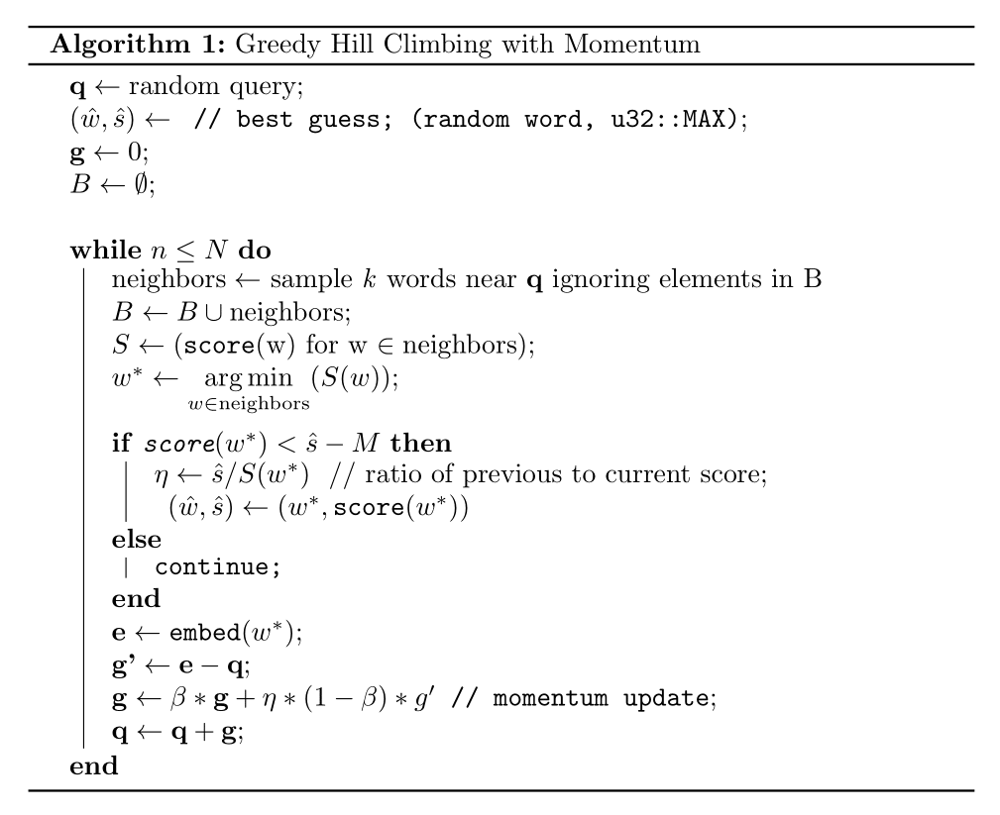

# Konteksto
Solving [Contexto](https://contexto.me/en/) using greedy [hill climbing](https://en.wikipedia.org/wiki/Hill_climbing) with momentum.


# Structure of repo
* `konteksto-builder` : code used to build dataset and embeddings
* `konteksto-engine` : Rust implementation of our hill climbing algorithm (main logic [here](https://github.com/nnethercott/konteksto/blob/main/konteksto-engine/src/solver.rs#L173)). [Algorithm below](#solver). 
* `konteksto-web` : clone of contexto.me but with suggestions functionality

## The stack 
* [Qdrant](https://github.com/qdrant/qdrant) as a vector store
* [fastembed](https://github.com/qdrant/fastembed) as an embeddings generator
* Sqlite database for persisting attempts
* Maud, Axum, sqlx, HTMX for a reactive Rust web app 

# Running the code
You can run Konteksto in either standalone mode as a CLI or a web app. An associated [Docker image](https://hub.docker.com/repository/docker/nnethercott/konteksto/general) with all embeddings for each language baked into the layers is available on the Docker Hub. 

In standalone the solver iterates automatically in real time towards a solution, while in the web app users manually drive the solver state through word submissions.

In both cases we need a running Qdrant instance to handle vector search.

## CLI
An executable to configure and run the hill climbing algorithm in real time. Under the hood we directly contact the Contexto api to validate guesses iteratively.

The easiest way to run this is by running the commands below
```
$ docker compose up -d
$ docker-compose exec konteksto ./bin/solve --max-iters 25 --max-retries 3
```

A full list of options are configurable as below:
```bash
Usage: solve [OPTIONS]

Options:
      --game-id <GAME_ID>          [default: 42]
  -l, --lang <LANG>                language to play in; available langs are: 'en', 'pt-br', and 'es' [default: en]
      --grpc-port <GRPC_PORT>      grpc port where qdrant db is running on [env: QDRANT__SERVICE__GRPC_PORT=] [default: 6334]
      --max-retries <MAX_RETRIES>  number of times to randomly initialize search algorithm [default: 1]
      --max-iters <MAX_ITERS>      max number of iterations per solution attempt [default: 100]
      --beta <BETA>                decay rate in momemntum update [default: 0.5]
      --margin <MARGIN>            value under which "free mobility" is possible [default: 200]
  -h, --help                       Print help
```

[](https://asciinema.org/a/7YKKIisc5J5uvDfLXtkJb2n3f)

## web
A wrapper around Contexto built using axum, sqlx, maud, and htmx providing word suggestions. Proxies scoring requests to contexto.me. 

To play in either "en", "pt", or "es" simply run:
```
$ GAME_LANG=en docker compose up
```
and head to `http://localhost:5049/game/123`

There you'll have access to all games from contexto for that language, and suggestions generated by `konteksto-engine`.


# Elements of the solution
## Dataset creation
Inspecting contexto's page source we find the file `/static/js/gameApi.js` which lists the API endpoints for contexto;
  * a base url `https://api.contexto.me/machado`
  * endpoint for scoring guesses: `${baseUrl}/${language}/game/${gameId}/${word}`
  * endpoint listing top words per puzzle: `${baseUrl}/${language}/top/${gameId}`

A database of ~25k words is built by scraping over 500 games using the /top/${gameId} endpoint. This allows us to have a well-defined search space.

Previous attempts to build a dataset using [nltk](https://www.nltk.org/howto/corpus.html) or [publicly available lists](https://github.com/dwyl/english-words) were limited due to size (O(10^5) words) and non-overlap with contexto's own internal list.

## Vector search
We use [qdrant](https://github.com/qdrant/qdrant) and [fastembed](https://github.com/qdrant/fastembed) to generate and index embeddings per language. This results in a distinct Qdrant collection for English, Portuguese, and Spanish games.

To produce the embeddings [sentence-transformers/paraphrase-multilingual-MiniLM-L12-v2](https://huggingface.co/sentence-transformers/paraphrase-multilingual-MiniLM-L12-v2) is used to encode non-English words, while [BAAI/bge-small-en-v1.5](https://huggingface.co/BAAI/bge-small-en-v1.5) handles English words. We configure qdrant to store vectors in float16 format  to cut down on space. 

The grpc client is further used in addition to Rust to speed up the initial indexing process, as suggested in the [this blog post](https://qdrant.tech/articles/indexing-optimization/).

## Solver
`konteksto-engine` leverages the Rust client for qdrant and a few linalg packages to implement the hill climbing algorithm shown below



Heuristically the algorithm starts from an initial seed and modifies its search direction by exploring points in its neighborhood. The main difference between this algo and gradient descent is the greedy position moves; we accept only moves to words with lower scores. The contour plots for each are quite similar though;


# Limitations 
* Depending on the inital seed the convergence behaviour of the algorithm can be poor. This can be remedied with multiple restarts. 
* A growing list of banned words with each iteration adds overhead in the qdrant filtering. We can overcome this in part by clearing the list after a successful move has been made.
* We're only sampling 2 neighbors near a given query, as such we have a course estimate of the "gradient".
* Iterative convergence is probably not the most optimal solution to this problem. Humans would solve it by guessing randomly until receiving a positive signal, then iterating from there. We kind of address this with random restarts, but its not as streamlined.
